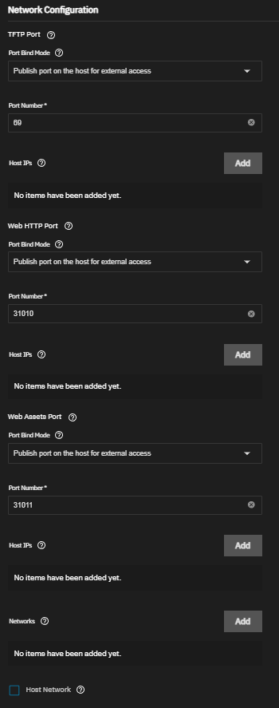
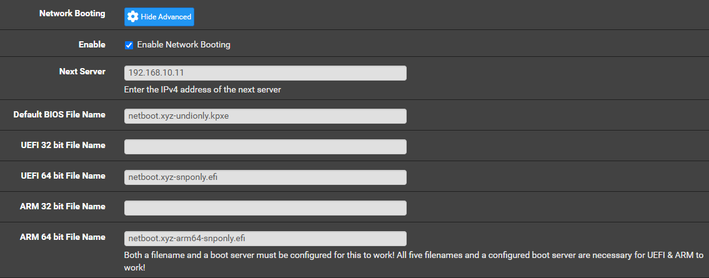

# PXE Boot Server

It can be useful to boot machines off of the network, rather than managing CDs or USBs and constantly re-burning ISO images. [netboot.xyz](https://netboot.xyz/) is a small iPXE bootloader that presents a menu of network installers, live distros, and rescue tools. The server manages all installation media.

## TrueNAS netboot.xyz App

netboot.xyz can be hosted on an existing TrueNAS server, and can store cached assets within a storage pool.

Create two new datasets, one for config storage, and one for assets storage. For example:
* Config = `/mnt/storage/netboot.xyz/config`
* Assets = `/mnt/storage/netboot.xyz/assets`

Install the netboot.xyz [community app](https://apps.truenas.com/catalog/netbootxyz_community/).
* Uncheck Use Host Network
* Set TFTP Port Bind Mode to "Publish"
* Set TFTP Port Number to 69[^1]
* Set Web HTTP Port Bind Mode to "Publish"
* Set Web HTTP Port Number to any unused port (default is fine).
* Set Web Assets Port Bind Mode to "Publish"
* Set Web Assets Port Number to any unused port (default is fine).

## pfSense DHCP

PXE clients find remote-bootable images via an extension to DHCP. The networking server must know the address of the PXE server and the name of the PXE image files.

Within the (interface-specific) DHCP settings.
* Check Enable Network Booting
* Set Next Server to the IPv4 address of the above netboot.xyz service.
* Set Default BIOS File Name to `netboot.xyz.kpxe`
* Set UEFI 64 bit File Name to `netboot.xyz.efi`
* Set ARM 64 bit File Name to `netboot.xyz-arm64.efi`

> [!NOTE]
> netboot.xyz does not support 32 bit firmware.

If a USB keyboard appears unresponsive, make the following changes in the DHCP server.
* Set Default BIOS File Name to `netboot.xyz-undionly.kpxe`
* Set UEFI 64 bit File Name to `netboot.xyz-snponly.efi`
* Set ARM 64 bit File Name to `netboot.xyz-arm64-snponly.efi`
Newer versions of netboot.xyz include their own hardware drivers, which can conflict with the USB drivers provided by the firmware. These alternate images supply "only" networking drivers, allowing the USB keyboard to be used normally.[^2][^3]

## BIOS/UEFI

Verify that the firmware allows booting off the network, and that network drivers are enabled during POST/pre-boot.

## Booting

Start up the target machine, enter its Boot Menu, and select "Network". This should load the netboot.xyz image and display a menu of operating systems.

## Footnotes

[^1]: [Trivial File Transfer Protocol](https://en.wikipedia.org/wiki/Trivial_File_Transfer_Protocol)
[^2]: netboot.xyz docs [USB Keyboard Not Working](https://netboot.xyz/docs/kb/hardware/usb-keyboard)
[^3]: netboot.xyz issue [USB keyboard working in 2.0.89 but no longer in 3.0.1](https://github.com/netbootxyz/netboot.xyz/issues/1769)