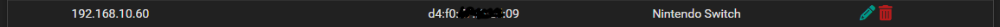
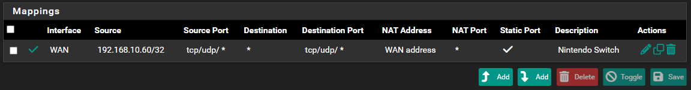
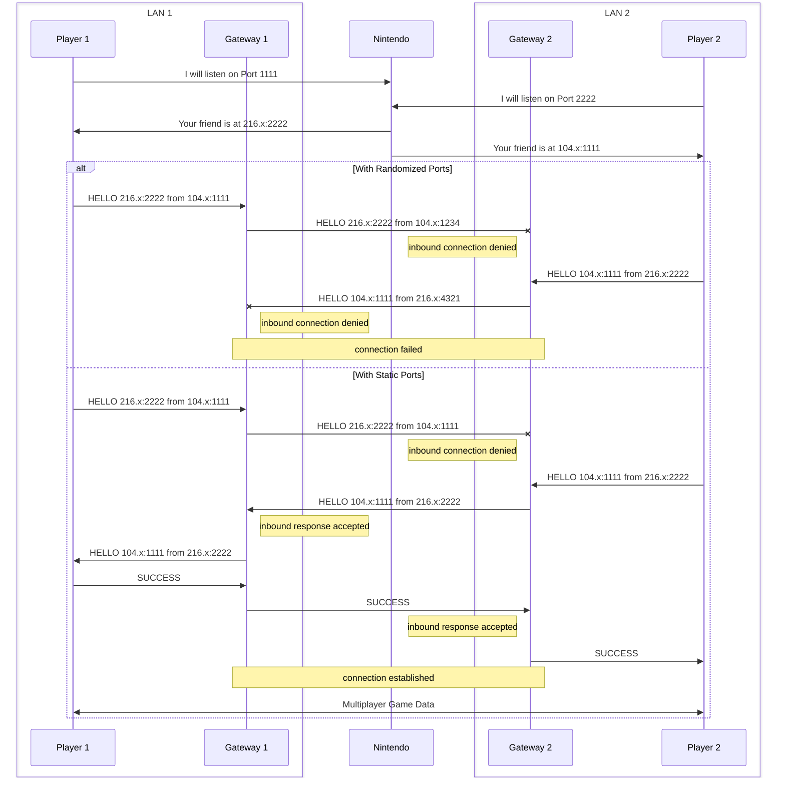

# Nintendo Switch Online

The default settings in a pfSense installation are not compatible with the way that Nintendo operates their online multiplayer network. This recipe reconfigures traffic originating from a Nintendo Switch console to allow direct connections to/from other Nintendo Switch consoles.

## DHCP Reservation

The NAT rule created below requires the Nintendo Switch console to have a predictable IP address. A simple way to ensure this is to provide a DHCP reservation.

1. Create a static DHCP mapping using the MAC address of the Nintendo Switch console and an IP address outside the normal DHCP range.

## NAT Rules

By default, pfSense includes an Outbound NAT rule that randomizes the source port for every NAT'd connection. Nintendo requires that the source port used by the Gateway is the same source port used by the Nintendo Switch console.

1. Set the Outbound NAT Mode to "Hybrid" or "Manual". Hybrid mode preserves the auto-generated rules, while Manual does not. The default of "Automatic" implicitly disables any custom rules, including the one set below.
2. Add a new Outbound NAT rule with the following properties:
    * Interface: WAN
    * Address Family: IPv4+IPv6 TODO: Is IPv4 sufficient?
    * Protocol: TCP/UDP TODO: Is UDP sufficient?
    * Source: {Static IP of Console}/32
    * Destination: Any
    * Address: WAN Address
    * Static Port: checked
    * Description: Nintendo Switch

## Alternatives

Nintendo Switch Online multiplayer can also be configured via UPnP, which is the technique most consumer-grade routers would use.

## Hole Punching

It is assumed that Nintendo Switch multiplayer networking involves [UDP hole punching](https://en.wikipedia.org/wiki/UDP_hole_punching). Nearly all consumer home networks employ NAT to run multiple Internet-connected devices on a single ISP-provided address. These networks also employ firewalls that prevent incoming connections. Hole punching allows a direct peer-to-peer connection between two Nintendo Switch consoles, without needing to allow incoming connections at the firewall. The following diagram shows how the randomized source ports (the default setting) prevents hole punching while static source ports enables the intended behavior.

While hole punching appears to bypass firewall restrictions, it does NOT allow unsolicited incoming connections. The technique only works when both parties initiate an outbound connection to each other, signalling intent to form a direct connection. If only one party initiated the connection, standard firewall rules would prevent access.